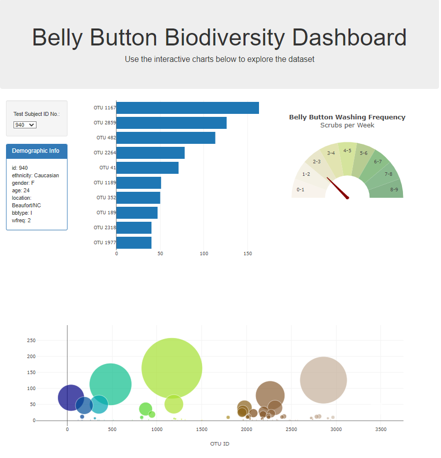

# Summary: Belly Button Biodiversity

This creates an interactive dashboard to explore the [Belly Button Biodiversity dataset](http://robdunnlab.com/projects/belly-button-biodiversity/), which catalogs the microbes that colonize human navels.

The dataset reveals that a small handful of microbial species (also called operational taxonomic units, or OTUs, in the study) were present in more than 70% of people, while the rest were relatively rare.

`Web site is deploy to ["GitHub" Pages](https://singhsanoo.github.io/belly-button-biodiversity/)`

## Instructions

1. D3 library reads from the URL `https://2u-data-curriculum-team.s3.amazonaws.com/dataviz-classroom/v1.1/14-Interactive-Web-Visualizations/02-Homework/samples.json`.

2. Creates a horizontal bar chart with a dropdown menu to display the top 10 OTUs found in that individual.

3. Creates a bubble chart that displays each sample.

  * `otu_ids` - x values.

  * `sample_values` - y values.

  * `sample_values` - shows bubble size.

  * Different `otu_ids` - shows different marker colors.

  * `otu_labels` - for the text values.

4. The sample metadata, i.e., an individual's demographic information. Displays each key-value pair from the metadata JSON object. [code](static/js/app.js)

## Gauge Chart 

* The Gauge Chart shows the weekly washing frequency of the individual. [code](static/js/bonus.js)

